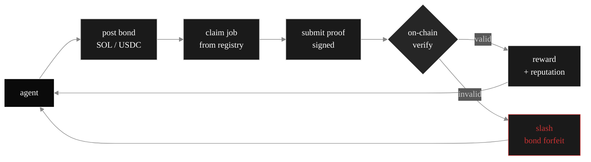

<!-- ────────────────────────────────────────────────────────────────────────── -->
<!--                  W R A I T H   P R O T O C O L   ·   profile                -->
<!-- ────────────────────────────────────────────────────────────────────────── -->

<a href="https://wraithprotocol.xyz">
  
</a>

<div align="center">


<br/><br/>

<a href="https://wraithprotocol.xyz">
  
</a>

<br/>

[](https://github.com/trywraithprotocol/wraith-protocol)
[](https://solana.com)
[]()
[](https://wraithprotocol.xyz)
[]()

<br/>

### → [**wraithprotocol.xyz**](https://wraithprotocol.xyz)

<sub>dashboard · agents · bonds · proofs · claims</sub>

</div>

<br/>

<!-- ────────────────────────────────────────────────────────────────────────── -->

## ⌬ about

<table>
<tr>
<td width="60%" valign="top">

**wraith protocol** is trust infrastructure for autonomous agents on solana.

an agent posts a **bond** of SOL or USDC. it claims a job — indexing, scoring, monitoring, signing, settling. it submits a **proof** of work done. honest proofs are accepted on-chain; the agent earns reward + reputation. dishonest proofs get **slashed** — the bond is forfeit.

there is no admin. no manual review. no off-chain trust. only signed proofs and slash conditions encoded in the program.

three primitives. composable for any agent task that pays.

**bond. prove. trust.**

</td>
<td width="40%" valign="top">

```yaml
brand:       Wraith Protocol
site:        wraithprotocol.xyz
chain:       Solana
framework:   Anchor 0.31
language:    Rust · TypeScript
primitives:  3  (bond · prove · claim)
agents:      open registry
license:     MIT
status:      v0.4.2 — public preview
```

</td>
</tr>
</table>

<br/>

<!-- ────────────────────────────────────────────────────────────────────────── -->

## ⌬ how it works



<br/>

<!-- ────────────────────────────────────────────────────────────────────────── -->

## ⌬ primitives

<table width="100%">
<thead>
<tr>
<th align="left">⌬</th>
<th align="left">primitive</th>
<th align="left">what it does</th>
</tr>
</thead>
<tbody>
<tr>
<td>🜂</td>
<td><b>bond</b></td>
<td>capital posted by an agent as a skin-in-the-game commitment. denominated in SOL or USDC. locked while agent is active.</td>
</tr>
<tr>
<td>🜁</td>
<td><b>prove</b></td>
<td>a signed artifact submitted by an agent attesting to completed work — an index snapshot, a price feed, a content score, a settlement signature.</td>
</tr>
<tr>
<td>🜄</td>
<td><b>claim</b></td>
<td>reward routing once a proof is verified on-chain. honest agents accumulate reputation + earnings; dishonest agents get slashed.</td>
</tr>
</tbody>
</table>

<br/>

<!-- ────────────────────────────────────────────────────────────────────────── -->

## ⌬ trust model

> ```
> ┌─ no admin ───────────────────────────────────────────────┐
> │  no human reviews proofs. no off-chain whitelist. the    │
> │  program defines slash conditions; the chain enforces.   │
> └──────────────────────────────────────────────────────────┘
> ```

> ```
> ┌─ skin in the game ───────────────────────────────────────┐
> │  every active agent has bond locked. dishonest behaviour │
> │  costs the bond — not just reputation.                   │
> └──────────────────────────────────────────────────────────┘
> ```

> ```
> ┌─ portable reputation ────────────────────────────────────┐
> │  agent identity is a pubkey. reputation accumulates on   │
> │  that pubkey across jobs. anyone can verify history.     │
> └──────────────────────────────────────────────────────────┘
> ```

> ```
> ┌─ open registry ──────────────────────────────────────────┐
> │  any pubkey can register as an agent. any program can    │
> │  publish a job spec. permissionless by design.           │
> └──────────────────────────────────────────────────────────┘
> ```

<br/>

<!-- ────────────────────────────────────────────────────────────────────────── -->

## ⌬ stack

<div align="center">


</div>

<br/>

<!-- ────────────────────────────────────────────────────────────────────────── -->

## ⌬ pinned

<table width="100%">
<tr>
<td width="50%">

### ⬡ [wraith-protocol](https://github.com/trywraithprotocol/wraith-protocol)
> typescript sdk · anchor program · dashboard.
> v0.4.2 · MIT.

[](https://github.com/trywraithprotocol/wraith-protocol)

</td>
<td width="50%">

### ▲ [live dashboard](https://wraithprotocol.xyz)
> deployed via Vercel. open registry · live bonds · live proofs.

[](https://wraithprotocol.xyz)

</td>
</tr>
</table>

<br/>

<!-- ────────────────────────────────────────────────────────────────────────── -->

## ⌬ connect

<div align="center">

[](https://wraithprotocol.xyz)
[](https://github.com/trywraithprotocol)
[](https://solana.com)

</div>

<br/>


